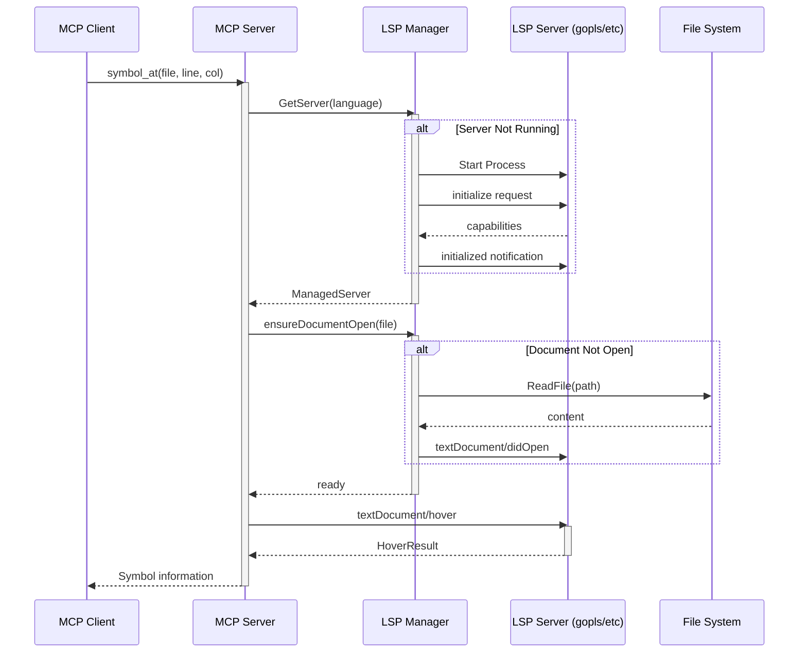
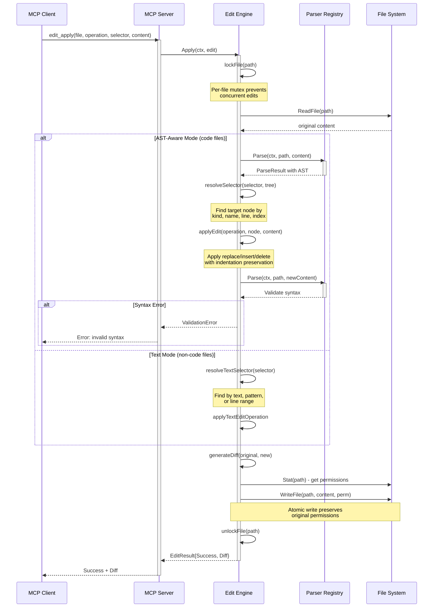
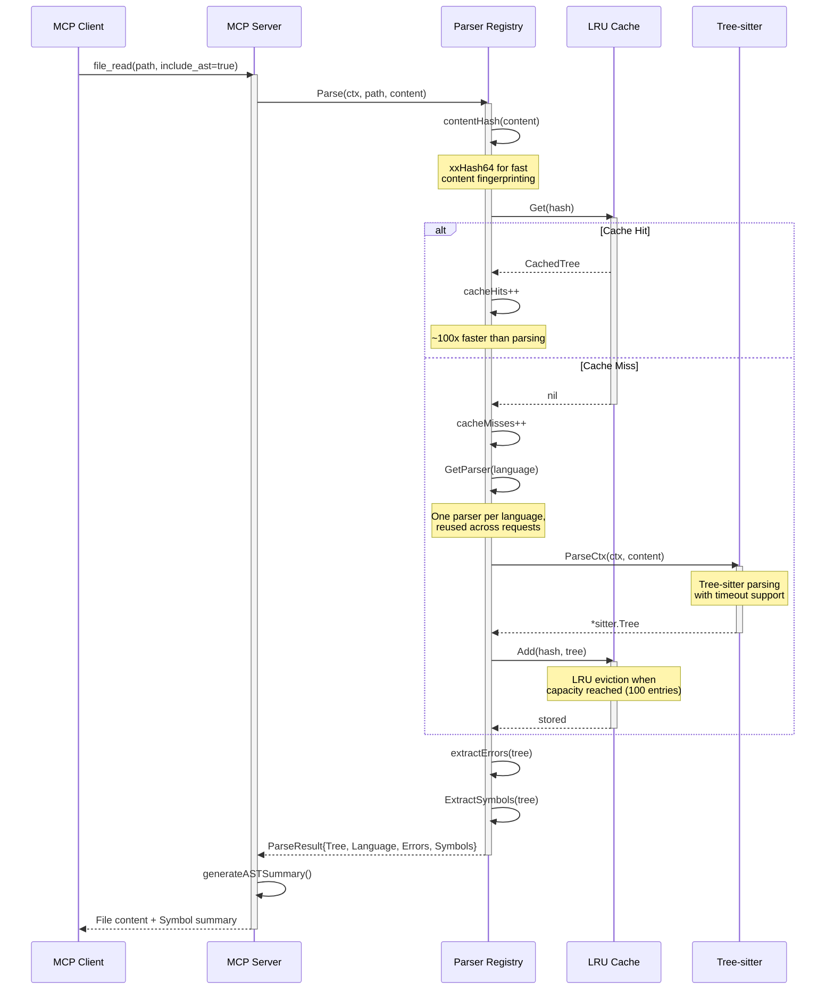
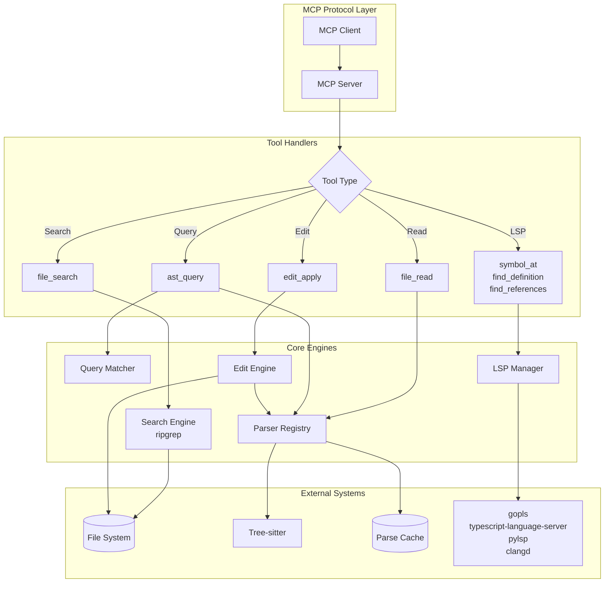

# mcp-filepuff

A Go-based MCP (Model Context Protocol) server for Claude Code providing intelligent file operations with fast search, AST-aware querying, LSP integration, and safe editing capabilities.

## Features

- **Fast Text Search**: Powered by ripgrep for blazing-fast code search with regex support
- **AST-Aware File Reading**: Read files with symbol extraction using Tree-sitter
- **Code Pattern Matching**: Query code using patterns with capture placeholders
- **LSP Integration**: Go-to-definition, find references, and symbol info via language servers
- **Safe Editing**: AST-aware file editing with syntax validation (edit_apply)
- **Multi-Language Support**: Go, TypeScript, JavaScript, Python, C, C++, HTML, Vue, React
- **Token Efficient**: Optimized for minimal token usage with symbols-only mode and output limiting

## Installation

### Quick Install (Recommended)

Install the latest version with a single command:

```bash
curl -sSL https://raw.githubusercontent.com/lukaszraczylo/filepuff-mcp/main/scripts/install.sh | bash
```

This script will:
- Automatically detect your platform (OS and architecture)
- Download the latest release
- Verify checksums
- Install to `~/.local/bin` (or `/usr/local/bin` if needed)
- Make the binary executable

### Docker

```bash
docker pull ghcr.io/lukaszraczylo/filepuff-mcp:latest
```

The MCP server communicates over stdio. Mount your workspace and run with `-i`:

```bash
docker run -i --rm -v /path/to/workspace:/workspace ghcr.io/lukaszraczylo/filepuff-mcp:latest -workspace /workspace
```

Claude Code configuration (`.claude/settings.json`):
```json
{
  "mcpServers": {
    "filepuff": {
      "command": "docker",
      "args": ["run", "-i", "--rm", "-v", ".:/workspace", "ghcr.io/lukaszraczylo/filepuff-mcp:latest", "-workspace", "/workspace"]
    }
  }
}
```

### Manual Installation

Download pre-built binaries from the [releases page](https://github.com/lukaszraczylo/filepuff-mcp/releases):

```bash
# macOS (Apple Silicon)
curl -fsSL -o mcp-filepuff https://github.com/lukaszraczylo/filepuff-mcp/releases/latest/download/mcp-filepuff_<version>_darwin_arm64
chmod +x mcp-filepuff && mv mcp-filepuff ~/.local/bin/

# Linux (ARM64)
curl -fsSL -o mcp-filepuff https://github.com/lukaszraczylo/filepuff-mcp/releases/latest/download/mcp-filepuff_<version>_linux_arm64
chmod +x mcp-filepuff && mv mcp-filepuff ~/.local/bin/

# Linux (AMD64)
curl -fsSL -o mcp-filepuff https://github.com/lukaszraczylo/filepuff-mcp/releases/latest/download/mcp-filepuff_<version>_linux_amd64
chmod +x mcp-filepuff && mv mcp-filepuff ~/.local/bin/

# Windows (PowerShell)
Invoke-WebRequest -Uri "https://github.com/lukaszraczylo/filepuff-mcp/releases/latest/download/mcp-filepuff_<version>_windows_amd64.exe" -OutFile mcp-filepuff.exe
Move-Item mcp-filepuff.exe $env:USERPROFILE\.local\bin\
```

Replace `<version>` with the actual version (e.g., `v1.0.0`).

### Prerequisites

- [ripgrep](https://github.com/BurntSushi/ripgrep) (`rg`) installed and in PATH

### Optional Dependencies (for LSP features)

- `gopls` - Go language server
- `typescript-language-server` - TypeScript/JavaScript language server
- `pylsp` - Python language server
- `clangd` - C/C++ language server

### Build from Source

```bash
git clone https://github.com/lukaszraczylo/filepuff-mcp.git
cd filepuff-mcp
make build
```

The binary will be available at `bin/mcp-filepuff`.

### Install via Claude Code

After downloading or building the binary, configure it in Claude Code:

1. **Create or edit `~/.config/claude-code/claude_desktop_config.json`**:

```json
{
  "mcpServers": {
    "filepuff": {
      "command": "/usr/local/bin/mcp-filepuff",
      "args": ["-workspace", "/path/to/your/workspace"],
      "env": {
        "MCP_LOG_LEVEL": "info"
      }
    }
  }
}
```

2. **Restart Claude Code** to load the MCP server

3. **Verify** by asking Claude: "Can you ping the filepuff server?"

See the [Claude Code MCP documentation](https://code.claude.com/docs/en/mcp) for more details.

### Recommended Claude Code Configuration

#### Selective Tool Deferral

For optimal performance, keep the most frequently used tools loaded at startup and defer the rest. This follows [Anthropic's recommended practice](https://www.anthropic.com/engineering/advanced-tool-use) of loading 3-5 high-use tools immediately:

```json
{
  "mcpServers": {
    "filepuff": {
      "command": "mcp-filepuff",
      "args": ["-workspace", "."],
      "alwaysAllow": ["file_read", "file_search", "edit_apply"]
    }
  }
}
```

This keeps `file_read`, `file_search`, and `edit_apply` immediately available while deferring less frequently used tools (`ping`, `ast_query`, `symbol_at`, `find_definition`, `find_references`).

#### System Prompt Guidance

Add the following to your `CLAUDE.md` to help Claude understand the available tool categories:

```markdown
You have access to filepuff MCP tools providing:
- File reading with AST symbol summaries (file_read)
- Fast regex search powered by ripgrep (file_search)
- Structural code pattern matching across 9+ languages (ast_query)
- LSP-powered go-to-definition, find-references, and symbol info (find_definition, find_references, symbol_at)
- AST-aware file editing with syntax validation (edit_apply)
```

## Usage

### Running the Server (Standalone)

```bash
./bin/mcp-filepuff -workspace /path/to/workspace
```

### Command Line Options

- `-workspace string`: Workspace root directory (default: current directory)
- `-log-level string`: Log level - debug, info, warn, error (default: "info")
- `-log-file string`: Log file path (default: stderr)

### Configuration

The server can be configured via:

1. **Environment Variables**:
   - `MCP_WORKSPACE_ROOT`: Workspace root directory
   - `MCP_LSP_TIMEOUT`: LSP timeout duration (e.g., "10m")
   - `MCP_SEARCH_TIMEOUT`: Search timeout duration (e.g., "1m")
   - `MCP_ENABLE_LSP`: Enable LSP features ("true"/"false")
   - `MCP_FOLLOW_SYMLINKS`: Follow symbolic links ("true"/"false")
   - `MCP_RESPECT_GITIGNORE`: Respect .gitignore files ("true"/"false")

2. **Config File**: Create `.mcp-filepuff.json` in the workspace root:
   ```json
   {
     "enable_lsp": true,
     "follow_symlinks": true,
     "respect_gitignore": true
   }
   ```

### Claude Code Integration

To use mcp-filepuff with Claude Code, add it to your MCP server configuration:

1. **Global Configuration** (`~/.config/claude-code/mcp_servers.json`):
   ```json
   {
     "mcpServers": {
       "filepuff": {
         "command": "/path/to/mcp-filepuff",
         "args": ["-workspace", "/path/to/your/workspace"]
       }
     }
   }
   ```

2. **Project-specific Configuration** (`.claude/mcp_servers.json` in your project):
   ```json
   {
     "mcpServers": {
       "filepuff": {
         "command": "mcp-filepuff",
         "args": ["-workspace", "."]
       }
     }
   }
   ```

After configuration, Claude Code will have access to all mcp-filepuff tools for enhanced file operations.

### Making Claude Code Prefer Filepuff Tools

By default, Claude Code uses its built-in file operation tools. To make it prefer filepuff's enhanced tools, add instructions to your `CLAUDE.md` file:

**Global Configuration** (`~/.claude/CLAUDE.md`):
```markdown
# MCP Tool Preferences

When performing file operations, prefer filepuff MCP tools over built-in equivalents:

| Operation | Use This | Instead Of |
|-----------|----------|------------|
| Read files | `mcp__filepuff__file_read` | Read |
| Search content | `mcp__filepuff__file_search` | Grep |
| AST pattern search | `mcp__filepuff__ast_query` | Grep/Glob |
| Edit files | `mcp__filepuff__edit_apply` | Edit |
| Find definitions | `mcp__filepuff__find_definition` | Grep |
| Find references | `mcp__filepuff__find_references` | Grep |
| Symbol info | `mcp__filepuff__symbol_at` | - |

Benefits of filepuff tools:
- AST-aware operations that understand code structure
- LSP integration for accurate symbol navigation
- Syntax validation before applying edits
```

You can also place this in a project-specific `CLAUDE.md` or `.claude/CLAUDE.md` file.

**Optional: Restrict Built-in Tools**

To enforce filepuff usage, add permission restrictions in `.claude/settings.json`:
```json
{
  "permissions": {
    "deny": ["Read", "Edit", "Grep"]
  }
}
```

## Available Tools

### `ping`
Health check tool to verify the server is running.

**Returns**: "pong"

---

### `file_search`
Search for text patterns in files using ripgrep.

**Parameters**:
- `pattern` (required): The search pattern (regex by default)
- `paths`: Paths to search in (defaults to workspace root)
- `file_types`: File types to search (e.g., ["go", "ts", "py"])
- `ignore_case`: Case insensitive search
- `regex`: Treat pattern as regex (default: true)
- `context_lines`: Number of context lines around matches (default: 2)
- `max_results`: Maximum number of results to return

---

### `file_read`
Read a file's contents with optional line range and AST symbol summary. Supports token-efficient modes for AI assistants.

**Parameters**:
- `path` (required): Path to the file to read
- `line_start`: Starting line number (1-indexed)
- `line_end`: Ending line number (inclusive)
- `include_ast`: Include AST symbol summary (functions, classes, types, etc.)
- `symbols_only`: **[Token Efficient]** Return only symbol summary without file content. Requires `include_ast=true`. Reduces token usage by ~90-98%.
- `max_lines`: **[Token Efficient]** Maximum number of lines to return. Useful for large files where you only need a preview.

**Example Output with AST**:
```
**server.go** (245 lines, go)

Symbols:
  func NewServer  L12
  func (Server).Start  L45
  struct Server  L5
  type Config  L150

---

   12│ func NewServer(config Config) *Server {
   13│     return &Server{config: config}
   14│ }
```

**Token-Efficient Example (symbols_only)**:
```json
{"path": "server.go", "include_ast": true, "symbols_only": true}
```
Returns only the symbol summary (~500 tokens instead of ~8,000 tokens for the full file):
```
**server.go** (245 lines, go)

Symbols:
  func NewServer  L12
  func (Server).Start  L45
  struct Server  L5
  type Config  L150
```

**Token-Efficient Example (max_lines)**:
```json
{"path": "server.go", "max_lines": 50}
```
Returns first 50 lines with a truncation notice if the file is longer.

---

### `ast_query`
Search for AST patterns in code files using structural pattern matching.

**Parameters**:
- `pattern` (required): Code pattern with placeholders
  - `$NAME` - capture single node
  - `$$$ARGS` - capture multiple nodes
  - `$_` - wildcard (match but don't capture)
- `language` (required): Target language (go, typescript, javascript, python, c, cpp)
- `paths`: Paths to search in
- `name_matches`: Regex pattern to filter by name
- `name_exact`: Exact name to match
- `kind_in`: Node types to match (e.g., function_declaration)
- `max_results`: Maximum number of results (default: 100)

**Examples**:
```json
// Find all Go functions returning error
{"pattern": "func $NAME($$$ARGS) error", "language": "go"}

// Find all Python classes
{"pattern": "class $NAME: $$$BODY", "language": "python"}

// Find React components (functions starting with uppercase)
{"pattern": "function $NAME($PROPS) { $$$BODY }", "language": "javascript", "name_matches": "^[A-Z]"}
```

---

### `symbol_at`
Get information about the symbol at a specific position. Uses LSP when available, falls back to AST.

**Parameters**:
- `file` (required): Path to the file
- `line` (required): Line number (1-indexed)
- `column` (required): Column number (1-indexed)

---

### `find_definition`
Find the definition of the symbol at a specific position.

**Parameters**:
- `file` (required): Path to the file
- `line` (required): Line number (1-indexed)
- `column` (required): Column number (1-indexed)

---

### `find_references`
Find all references to the symbol at a specific position.

**Parameters**:
- `file` (required): Path to the file
- `line` (required): Line number (1-indexed)
- `column` (required): Column number (1-indexed)
- `include_declaration`: Include the declaration in results (default: true)

---

### `edit_apply`
Apply an edit to a file. Uses AST-aware editing for code files with syntax validation, and text-based editing for other files.

**Parameters**:
- `file` (required): Path to the file to edit
- `operation` (required): Edit operation (replace, insert_before, insert_after, delete)
- `new_content`: New content (required for replace/insert operations)

**AST-mode selectors** (for code files):
- `selector_kind`: Node type to match (e.g., function_declaration)
- `selector_name`: Name of the symbol to match

**Shared selectors**:
- `selector_line`: Line number (1-indexed). For AST mode: narrows search. For text mode: start of line range.
- `selector_index`: Index of the match to use if multiple matches found (default: 0)

**Text-mode selectors** (for non-code files or explicit text matching):
- `selector_line_end`: End line number for range selection
- `selector_text`: Exact text to match (must be unique or use selector_index)
- `selector_pattern`: Regex pattern to match

**Example (AST mode - Go file)**:
```json
{
  "file": "server.go",
  "operation": "replace",
  "selector_kind": "function_declaration",
  "selector_name": "Hello",
  "new_content": "func Hello() {\n\tprintln(\"New Hello\")\n}"
}
```

**Example (Text mode - Markdown file)**:
```json
{
  "file": "README.md",
  "operation": "replace",
  "selector_text": "## Installation",
  "new_content": "## Getting Started"
}
```

**Example (Text mode - JSON with regex)**:
```json
{
  "file": "package.json",
  "operation": "replace",
  "selector_pattern": "\"version\":\\s*\"[^\"]+\"",
  "new_content": "\"version\": \"2.0.0\""
}
```

**Example (Text mode - Line range)**:
```json
{
  "file": "config.yaml",
  "operation": "replace",
  "selector_line": 5,
  "selector_line_end": 10,
  "new_content": "database:\n  host: production.db.example.com\n  port: 5432"
}
```

## Supported Languages

| Language | Extensions | Search | AST | LSP | Edit |
|----------|-----------|--------|-----|-----|------|
| Go | .go | Yes | Yes | gopls | Yes |
| TypeScript | .ts, .tsx | Yes | Yes | typescript-language-server | Yes |
| JavaScript | .js, .jsx, .mjs, .cjs | Yes | Yes | typescript-language-server | Yes |
| Python | .py, .pyw | Yes | Yes | pylsp | Yes |
| C | .c, .h | Yes | Yes | clangd | Yes |
| C++ | .cpp, .cc, .cxx, .hpp, .hxx | Yes | Yes | clangd | Yes |
| HTML | .html, .htm | Yes | Yes | - | Yes |
| Vue | .vue | Yes | Yes* | - | Yes |
| React | .jsx, .tsx | Yes | Yes | typescript-language-server | Yes |
| Elixir | .ex, .exs | Yes | Yes | elixir-ls | Yes |

\* Vue uses HTML parser for template sections

## Development

### Build

```bash
make build
```

### Run Tests

```bash
make test
```

### Lint

```bash
make lint
```

### Clean

```bash
make clean
```

## Project Structure

```
.
├── cmd/
│   └── mcp-filepuff/       # Main entry point
├── internal/
│   ├── config/             # Configuration management
│   ├── edit/               # AST-aware editing engine
│   ├── lsp/                # LSP client and manager
│   ├── parser/             # Tree-sitter integration
│   ├── query/              # AST pattern matching
│   ├── search/             # Ripgrep wrapper
│   └── server/             # MCP server implementation
├── pkg/
│   └── protocol/           # Shared types
├── .github/
│   └── workflows/          # CI configuration
├── Makefile               # Build automation
├── .goreleaser.yaml       # Release configuration
└── TODO.md                # Implementation roadmap
```

## Architecture

### High-Level Overview

```
┌─────────────────────────────────────────────────────────┐
│                    MCP Server                           │
├─────────────────────────────────────────────────────────┤
│  Tools: file_search, file_read, ast_query, symbol_at,  │
│         find_definition, find_references, edit_apply, ping                 │
├─────────────────────────────────────────────────────────┤
│                    Core Engines                         │
├───────────┬─────────────┬────────────┬─────────────────┤
│  Search   │   Parser    │    LSP     │     Edit        │
│ (ripgrep) │(tree-sitter)│  Manager   │    Engine       │
└───────────┴─────────────┴────────────┴─────────────────┘
```

### Detailed Sequence Diagrams

#### LSP Integration Flow

The following diagram shows how LSP requests (hover, definition, references) flow through the system:



#### Edit Operation Flow

The edit engine uses atomic writes and validation to ensure safe file modifications:



#### Parse and Cache Flow

The parser uses content-based caching for efficient AST reuse:



#### Request Flow Summary



## Troubleshooting

### Common Issues

#### "ripgrep not found" Error
The `file_search` tool requires ripgrep (`rg`) to be installed and in your PATH.

**Solution**: Install ripgrep:
```bash
# macOS
brew install ripgrep

# Ubuntu/Debian
sudo apt install ripgrep

# Windows (with Chocolatey)
choco install ripgrep
```

#### LSP Features Not Working
LSP features (go-to-definition, find-references, symbol-at) require language servers to be installed.

**Solution**: Install the appropriate language server:
```bash
# Go
go install golang.org/x/tools/gopls@latest

# TypeScript/JavaScript
npm install -g typescript-language-server typescript

# Python
pip install python-lsp-server

# C/C++
# macOS: brew install llvm
# Ubuntu: sudo apt install clangd
```

#### AST Parsing Fails for Valid Code
If AST parsing fails for code that compiles correctly, it may be a Tree-sitter grammar limitation.

**Solution**:
- Ensure the file has the correct extension for its language
- Check for unusual syntax that may not be supported by the Tree-sitter grammar
- Try using the `file_search` tool instead for text-based operations

#### Edit Operations Fail with "syntax error"
The edit engine validates syntax before and after edits.

**Solution**:
- Ensure `new_content` is syntactically valid for the target language
- Check that the selector matches exactly one node

#### Timeout Errors
Long-running operations may timeout.

**Solution**: Configure timeout values via environment variables:
```bash
export MCP_LSP_TIMEOUT="10m"      # LSP operations (default: 5m)
export MCP_SEARCH_TIMEOUT="2m"    # Search operations (default: 30s)
```

#### Permission Denied Errors
The server needs read/write access to workspace files.

**Solution**:
- Ensure the user running the server has appropriate file permissions
- Check that the workspace path is correct and accessible
- On macOS, grant terminal/IDE full disk access if needed

### Debug Logging

Enable debug logging to troubleshoot issues:

```bash
./bin/mcp-filepuff -workspace /path/to/workspace -log-level debug -log-file /tmp/mcp-filepuff.log
```

### Verifying Installation

Use the `ping` tool to verify the server is running correctly:

```json
{"tool": "ping"}
```

Expected response: `"pong"`

## Telemetry

On startup this MCP server sends a single anonymous adoption ping — project
name, version, timestamp; no identifiers, no tool call data, no file
contents. Fire-and-forget with a 2-second timeout; cannot block startup
or panic.

See **[oss-telemetry — Disabling telemetry](https://github.com/lukaszraczylo/oss-telemetry#disabling-telemetry)**
for the exact wire format, source, and full opt-out documentation.

Quick opt-out: set any of `DO_NOT_TRACK=1`, `OSS_TELEMETRY_DISABLED=1`,
or `MCP_FILEPUFF_DISABLE_TELEMETRY=1`.

## License

MIT License
